# Construcción de un Perceptrón Multicapa

En el mundo del desarrollo de software, todo el tiempo se escriben programas para resolver problemas o realizar tareas (o, a veces, solo por diversión). En su mayor parte, aparte de los errores, siempre que le diga a la computadora qué hacer de manera muy clara (en el lenguaje de programación que use) obedecerá obedientemente nuestras instrucciones.

Esto es porque el computador y sus programas son excelentes a la hora de ejecutar algoritmos - instrucciones que siguen pasos definidos y patrones que son precisos y, en muchas ocasiones, repetitivos. Y en la mayoría de los casos esto es suficiente para llevar a cabo tareas como procesar muchos datos o trabajos repetitivos.

Pero en lo que los computadores y sus programas no son muy buenos, son las tareas que no están tan bien definidas, y que no siguen patrones precisos. Por ejemplo, ¿cómo se puede escribir un programa que reconozca un pájaro? ¿O un programa que reconozca un rostro? ¿O un programa que reconozca un idioma?


> En los años 60, Marvin Minsky asignó a un par de estudiantes en camino a graduarse la tarea de programar un computador para usar una cámara para identificar objetos en una escena. Su estimación era que lo tendrían resuelto para el final del verano. Medio siglo después, todavía estamos trabajando en ello.

Entonces, ¿cómo podemos usar computadores para realizar esas tareas? Primero debemos pensar en cómo haríamos esa tarea _nosotros mismos_. Probablemente todos aprendimos sobre aves cuando éramos jóvenes, y se nos dijo que ciertos animales son aves y otros no, usualmente viéndolos en la vida real o a través de fotos en libros. Y cuando nos equivocábamos, se nos hacía saber y lo recordábamos. Con el tiempo desarrollamos un _modelo mental_ de lo que es un ave y lo que no. Cada vez que vemos una parte de un ave (patas con garras, alas emplumadas, pico afilado) ya no necesitamos ver todo el animal, lo identificamos automáticamente comparándolo con nuestro modelo mental.


Entonces, ¿cómo podemos hacer esto con programas de computadora? Básicamente hacemos lo mismo. Tratamos de crear un _modelo_ que podamos usar para comparar las entradas, a través de un proceso de prueba y error. Y dado que los programas de computadora son todos matemáticas, puedes adivinar que va a ser un _modelo matemático_ del que vamos a estar hablando.

## El juego de adivinanzas

Tomemos un ejemplo simple: Crear una caja negra que acepte una entrada y trate de predecir la salida.

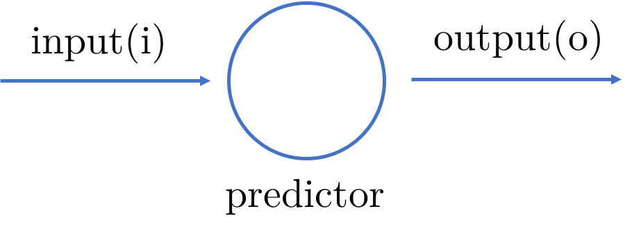

Se da una entrada y obtenemos la salida de este predictor. Como sabemos cuál debería ser la salida real, podemos decir qué tan diferente es la salida predicha de la salida real. Esta diferencia entre la salida real y la predicha se convierte en el _error_.

Por supuesto, si el predictor es estático y no puede ser cambiado, todo es bastante inútil. Cuando alimentamos nuestro predictor con una entrada, se produce una salida con un error y ese es el final de la historia. No muy útil.

Para hacer este predictor más útil, démosle un parámetro configurable que podamos usar para influir en la salida. Como solo predice correctamente si no hay error, queremos cambiar el parámetro de tal manera que el error disminuya a medida que seguimos alimentando el predictor con datos. El objetivo es obtener un predictor que prediga la salida correcta la mayor parte del tiempo, sin necesidad de dar instrucciones claras al predictor.

En otras palabras, esto es muy parecido a un juego de adivinanzas de números.

Ahora veámoslo en una manera más práctica. Digamos que tenemos un predictor con la fórmula matemática simple `o = i x c` donde `o` es la salida, `i` es la entrada y `c` es un parámetro configurable.

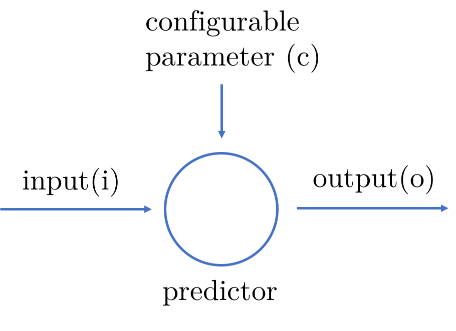

También tenemos una salida válida confirmada con su entrada correspondiente. Es decir, sabemos que si `i` es 10, `o` es 26. ¿Cómo encontramos `c` usando el predictor?

Primero, tomamos una predicción arbitraria, por ejemplo, `c` es 2. Pongamos en la entrada 10 y usemos el predictor. La salida `o` es 20. Dado que el error `e = t - o` donde `t` es la verdad (o el objetivo), esto significa que `e = 26 - 20 = 6`. Nuestro error `e` es 6 y queremos lograr 0, así que intentemos de nuevo.

Entonces hagamos que `c` sea 3. La salida es entonces `30` y es `e` ahora `-4`. ¡Ups, nos pasamos! Volvamos un poco y hagamos que `c` sea 2.5. Eso hace que `o` sea 25, y `e` sea 1. Finalmente intentamos `c` para que sea 2.6 y obtenemos el error `e` para que sea 0.

Una vez sepamos el valor de `c`, podemos usar el predictor para predecir la salida para otras entradas. Digamos que la entrada `i` es ahora 20, entonces podemos predecir que `o` es 52.

Como podemos ver ahora, este método intenta encontrar la respuesta de manera iterativa y mejorarse a sí mismo a medida que avanza, hasta que obtengamos el mejor ajuste. Esto es esencialmente lo que es el [aprendizaje automático](https://medium.com/machine-learning-for-humans/why-machine-learning-matters-6164faf1df12). El programa intenta encontrar respuestas de manera iterativa y _aprende_ a través de sus errores hasta que logra un modelo que puede producir la mejor respuesta. Una vez que tiene el modelo correcto, podemos usar el modelo para adivinar las respuestas correctas. Esto es muy similar a lo que hacemos los humanos (aprendiendo de los errores pasados y corrigiéndonos) pero, ¿cómo exactamente lo hacemos?

## ¿Cómo lo hacen los humanos?

Vamos por un momento a un ámbito diferente. Ya hablamos de cómo una máquina puede aprender usando funciones matemáticas. La forma en que los humanos hacen lo mismo (como la investigación a lo largo de los años ha demostrado) es usando algo llamado [neurona](https://www.verywellmind.com/what-is-a-neuron-2794890).

Una neurona, o célula nerviosa, es una célula que recibe información, la procesa y la transmite usando señales eléctricas y químicas. Nuestro cerebro y nuestra médula espinal (partes de lo que llamamos Sistema Nervioso Central) están compuestos por neuronas.

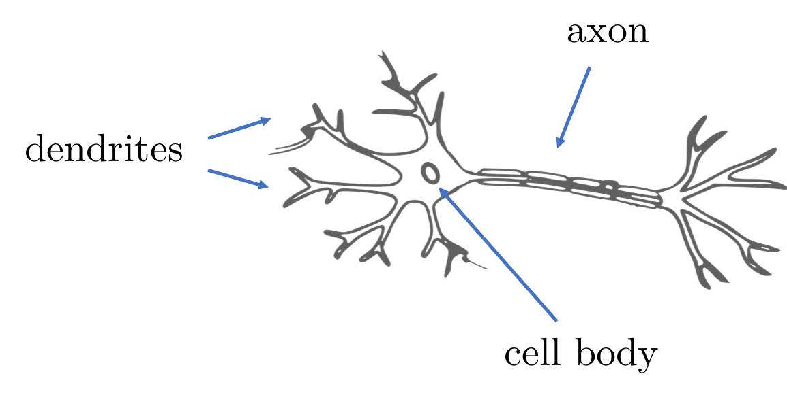

Una neurona consiste de un cuerpo celular, dendritas y un axón y puede conectarse con otras neuronas para formar redes neuronales. En una red neuronal, el axón de una neurona está conectado a las dendritas de la siguiente neurona y las señales sinápticas se transmiten desde una neurona a través de su axón, y recibidas por la siguiente neurona a través de sus dendritas. Las conexiones entre el axón y las dendritas son la sinapsis.

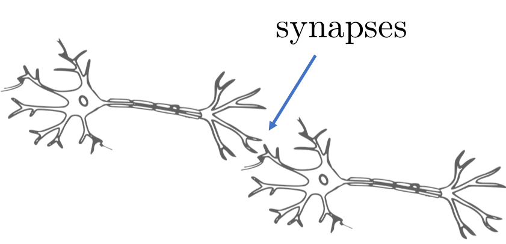

Las señales que entran a través de las dendritas se fortalecen o debilitan según la frecuencia con que se usan las conexiones sinápticas y estas señales fortalecidas o debilitadas se agrupan en el cuerpo celular.

Si las señales agrupadas que se reciben son lo suficientemente fuertes, desencadenarán una nueva señal que se enviará a través del axón a otras neuronas.

Como podemos ver, el funcionamiento de una neurona es algo análogo a nuestro predictor anterior. Tiene una serie de entradas a través de sus dendritas que procesa y una salida a través de su axón. En lugar de un parámetro configurable, cada entrada está emparejada con la fuerza (o peso) de la conexión sináptica.

Con esta información, volvamos a nuestro predictor y hagamos algunos cambios.

# Neuronas artificiales

Comencemos construyendo una neurona artificial que imite la neurona biológica real. Esta neurona artificial es nuestro predictor mejorado.

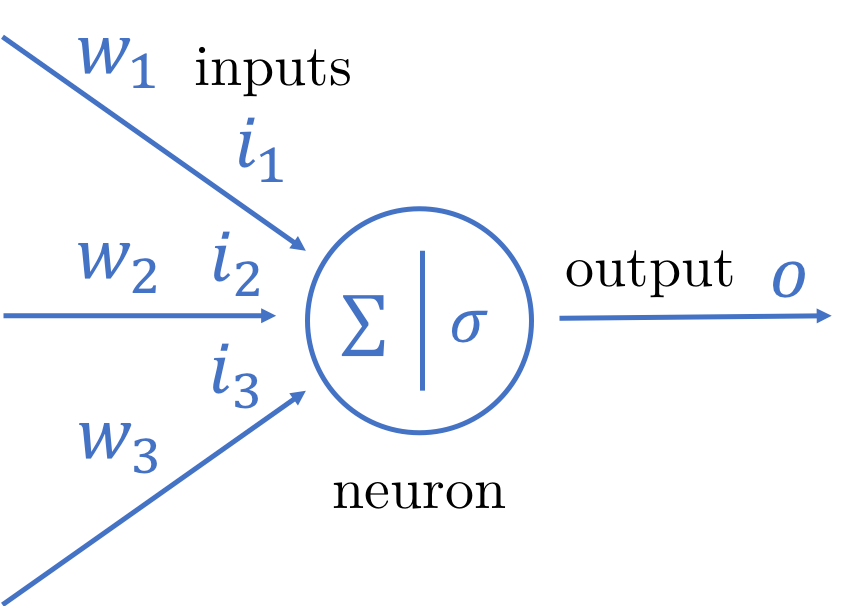

En lugar de una sola entrada tenemos un montón de entradas, cada una de las cuales está conectada a una conexión sináptica con un peso (en lugar de un parámetro configurable). Estas entradas modificadas se suman y se pasan a través de una [función de activación](https://medium.com/the-theory-of-everything/understanding-activation-functions-in-neural-networks-9491262884e0) que determina si se debe enviar una salida.

¿Por qué una función de activación? Más allá del hecho de que una neurona biológica se comporta de esta manera, hay buenas razones, pero una de las más importantes es que las funciones de activación introducen la no linealidad en la red. Una red neuronal sin funciones de activación (o una función de activación lineal) es básicamente solo un modelo de [regresión lineal](http://onlinestatbook.com/2/regression/intro.html) y no puede realizar tareas más complicadas como traducciones de idiomas y clasificaciones de imágenes. Veremos más adelante cómo las funciones de activación no lineales permiten la propagación hacia atrás.

Por ahora, podemos asumir el uso de una función de activación común, la [función sigmoide](https://ipfs.io/ipfs/QmXoypizjW3WknFiJnKLwHCnL72vedxjQkDDP1mXWo6uco/wiki/Sigmoid_function.html).

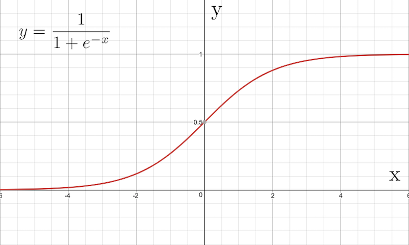

Un dato interesante de esta función es que la salida siempre está entre 0 y 1, pero nunca alcanza ninguno de ellos.

## Redes neuronales artificiales

Ahora que tenemos una neurona artificial, ¿cómo podemos usarla para resolver problemas más complicados? Una neurona artificial es como un predictor, pero ¿qué pasa si queremos predecir más de una cosa? ¿O si queremos predecir algo que no es un número? ¿O si queremos predecir algo que no es un número?

Así como tenemos las neuronas biológicas formando redes neuronales, también podemos conectar nuestras neuronas artificiales para formar redes neuronales artificiales.

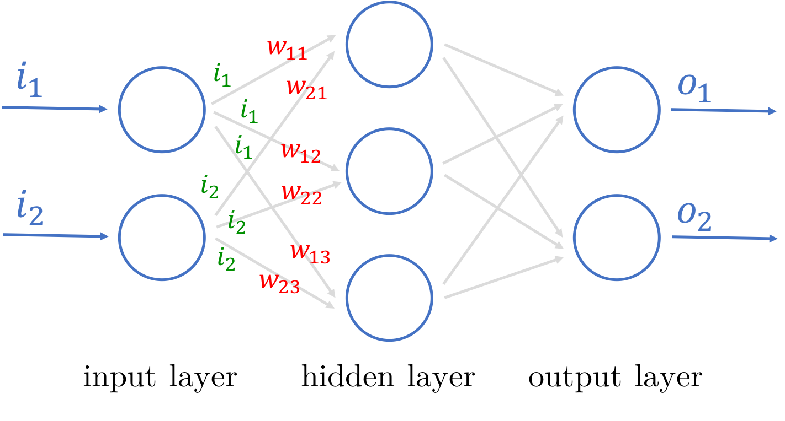

Parece complicado, ¿cierto?

Pero no lo es. En realidad solo estamos apilando las neuronas en diferentes capas. Todas las entradas entran a través de la capa de entrada, que envía su salida a la capa oculta, que a su vez envía su salida a la capa de salida final. Si bien la salida de cada nodo es la misma (solo hay 1 salida) pero las conexiones a las neuronas en la siguiente capa tienen pesos diferentes. Por ejemplo, las entradas al primer nodo en la capa oculta serían `(w11 x i1) + (w21 x i2)`.

## Simplificación de los cálculos usando matrices

Calcular las salidas finales en esta red puede ser tedioso si tenemos que hacerlo una salida a la vez, especialmente si tenemos un gran número de neuronas. Afortunadamente, hay una manera más fácil. Si representamos las entradas y las salidas como matrices, podemos usar operaciones entre matrices para que los cálculos sean más simples. De hecho, no necesitamos hacer sumas de entradas individuales o activación individual de las salidas. Solamente lo hacemos capa por capa.

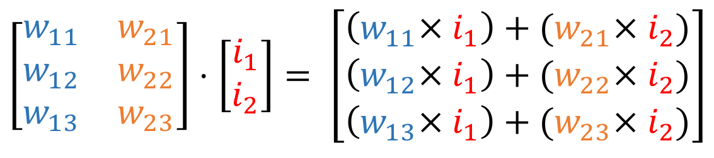

Esto nos ayudará mucho en el código, como veremos más adelante.

Usaremos el [producto punto](https://www.mathsisfun.com/algebra/matrix-multiplying.html) entre matrices para manejar la multiplicación y la suma de entradas y pesos, pero para la función de activación necesitaremos aplicar la función sigmoide a cada uno de los elementos de la matriz. Y debemos hacer esto para cada capa oculta, y también para la capa de salida.

## Modificando los pesos

Podremos darnos cuenta de que en este punto, nuestra red neuronal es (conceptualmente) simplemente una versión más grande de la neurona, y por lo tanto es muy parecida a nuestro predictor anterior. Y al igual que nuestro predictor, queremos entrenar a nuestra red neuronal para que aprenda de sus errores pasados ​​al pasarle una entrada con una salida conocida. Luego, usando la diferencia (error) entre las salidas conocidas y reales, cambiamos los pesos para minimizar el error.

Sin embargo, también podremos darnos cuenta de que la red neuronal es un poco más complicada que nuestro predictor. Primero, tenemos múltiples neuronas organizadas en capas. Como resultado, si bien conocemos la salida final objetivo, no conocemos las salidas objetivo intermedias de las diferentes capas intermedias. En segundo lugar, mientras que nuestro predictor es lineal, nuestras neuronas pasan a través de una función de activación no lineal, por lo que la salida no es lineal. Entonces, ¿cómo cambiamos los pesos de las diferentes conexiones?

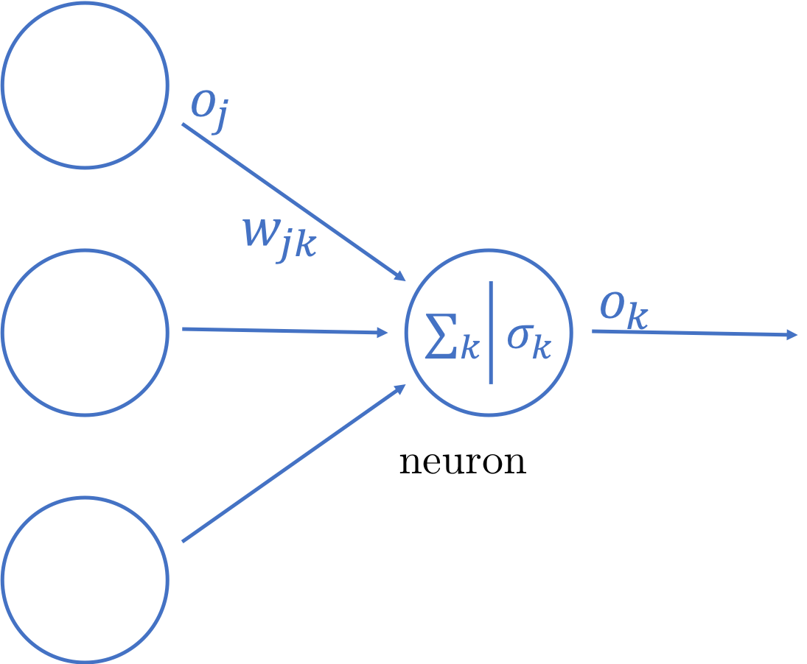

De nuestro predictor inicial aprendimos que debemos minimizar el error final de salida `Ek` cambiando los pesos de las salidas que conectan las capas ocultas con la capa de salida `wjk`.

Sí, suena maravilloso, ¿pero cómo minimizamos el valor de una función al cambiar su valor de entrada?

Veámoslo desde otra perspectiva. Sabemos que el error de salida final `Ek` es:

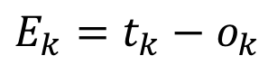

Pero solo restar `ok` de `tk` no es una muy buena idea, porque a menudo dará como resultado números negativos. Si estamos tratando de encontrar el error de salida final de la red, en realidad estamos sumando todos los errores, por lo que si algunos de ellos son números negativos, dará como resultado el error de salida final incorrecto. Una solución común es usar el _error cuadrático_, que como el nombre sugiere es:

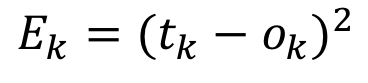

A la vez sabemos que:

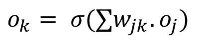

Es decir, que si mapeamos `Ek` con `wjk` tendremos un rango de valores (la línea azul) que podemos trazar en un gráfico:

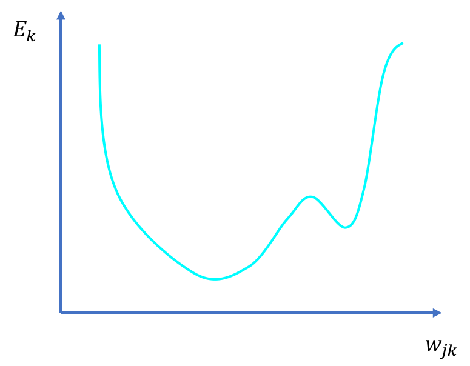

> En realidad el gráfico es tridimensional, pero por simplicidad usaremos un gráfico bidimensional para esta explicación.

Como podemos ver, para obtener el mínimo absoluto de `Ek` seguimos la pendiente negativa. En otras palabras, tratamos de encontrar la pendiente negativa, cambiamos el peso de acuerdo a ella y repetimos hasta alcanzar el mínimo absoluto de `Ek`. Este algoritmo se llama [_descenso de gradiente_](https://spin.atomicobject.com/2014/06/24/gradient-descent-linear-regression/) o _pendiente descendiente_.

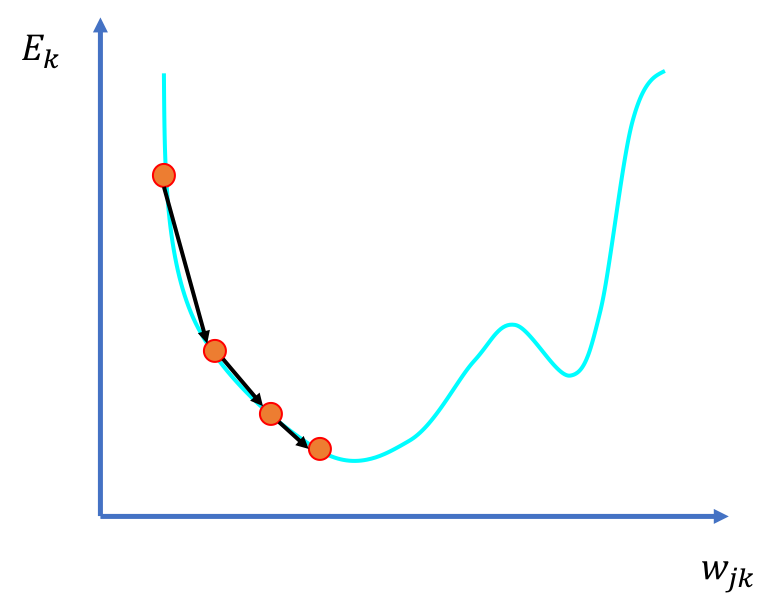

Regresemos un poco en el tiempo a nuestros cursos de cálculo diferencial. Para encontrar la pendiente de un punto en una función se utiliza la [derivada](https://www.mathsisfun.com/calculus/derivatives-introduction.html). Esto nos permite saber la medida en que debemos modificar a `wjk`. Para encontrar el valor mínimo de `Ek`, restamos esta cantidad de `wjk` y repetimos.

Hagamos los cálculos.

Para calcular el cambio que necesitamos para los pesos de salida `wjk` debemos calcular la derivada del error final `Ek` con respecto a los pesos de salida `wjk`. Esto significa:

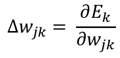

Sí, se ve interesante, ¿pero cómo obtenemos nuestros resultados usando las otras variables que tenemos? Para lograrlo usamos la [regla de la cadena](https://en.wikipedia.org/wiki/Chain_rule):

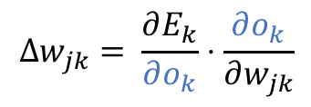

Se ve mejor, pero podemos ir un paso más adelante:

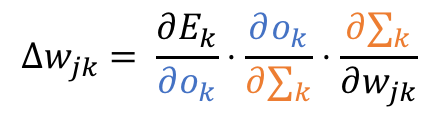

Entonces empecemos a trabajar. Primero, debemos encontrar la derivada de `Ek` con respecto a la salida final `ok`.

De antes sabemos que `Ek` es el error cuadrático:


Pero para derivarlo más fácilmente lo dividimos en dos:

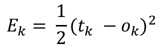

La derivada de esto es:

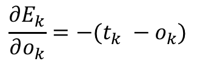

¡Se ve mucho más simple! Ahora veamos la derivada de la salida final `ok` con respecto a la sumatoria del producto de las salidas intermedias y los pesos, `∑k`. Sabemos que la sumatoria es pasada a través de una función sigmoide `σ` para obtener la salida final `ok`:

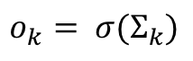

Entonces la derivada de la salida final `ok` con respecto a la sumatoria `∑k` es:

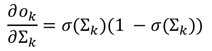

Esto es porque sabemos que la derivada de una sigmoide es:

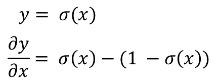

Anteriormente mencionamos que hay muy buenas razones para usar una función sigmoide - y la derivación sencilla es una de ellas. La prueba de ello está [aquí](http://kawahara.ca/how-to-compute-the-derivative-of-a-sigmoid-function-fully-worked-example/). Ahora, sabiendo que:


Podemos simplificar la ecuación un poco más:

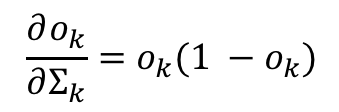

Finalmente queremos hallar la derivada de la sumatoria `∑k` con respecto al peso de salida `wjk`. Sabemos que la sumatoria es la suma del producto del peso de salida `wjk` y la salida previa `oj`:

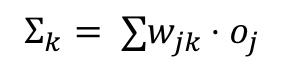

Entonces la derivada de la suma `∑k` con respecto al peso `wjk` es:

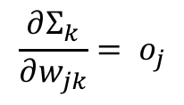

Ahora que tenemos las tres derivadas, vamos a juntarlas. Hace un momento dijimos que:


Por tanto:

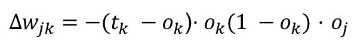

Con esto tenemos la ecuación para cambiar los pesos para la capa de salida. ¿Y ahora cómo hacemos con la capa oculta? Simplemente usamos la misma ecuación pero yendo una capa hacia atrás. Este algoritmo es llamado [_propagación_](http://neuralnetworksanddeeplearning.com/chap2.html) [_hacia atrás_](https://en.wikipedia.org/wiki/Backpropagation) porque calcula los pesos desde la salida final hacia atrás.

Pero aún no tenemos la salida objetivo para la capa oculta. ¿Entonces cómo vamos a obtener el error para la capa oculta? Debemos encontrar otra manera.

## Propagación hacia atrás de errores

Si pensamos en ello, el error de la capa de salida contiene las contribuciones de los errores de la capa oculta, de acuerdo con las conexiones de la anterior capa oculta. En otras palabras, la combinación de los errores de la capa oculta forma los errores de la capa de salida. Y ya que los pesos representan la importancia de la entrada, también representa la contribución del error.

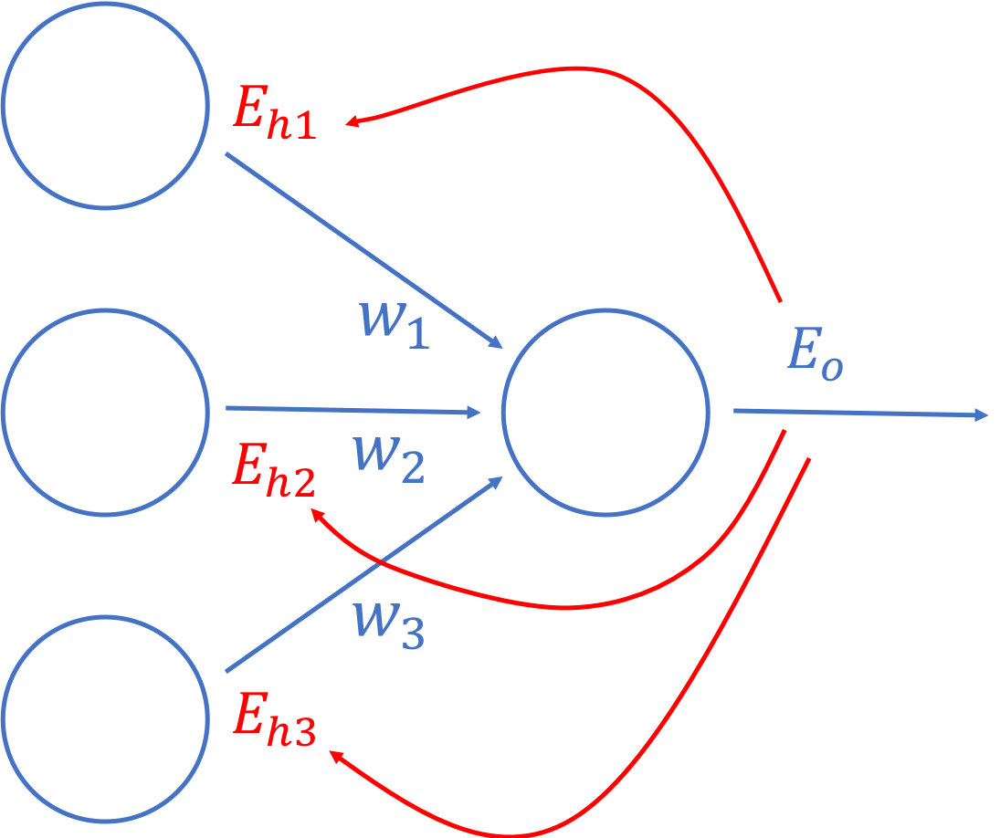

Como resultado, podemos usar la proporción de los pesos para calcular el cambio que debemos hacer para cada peso. Y ya que el denominador es constante, podemos simplificar esto un poco más eliminando los denominadores:

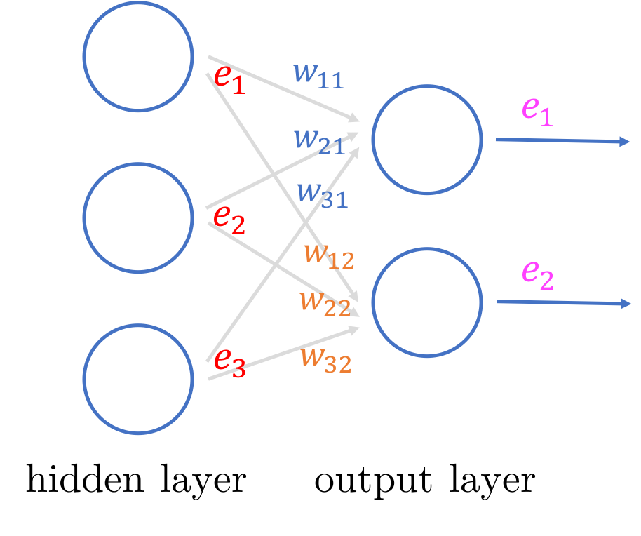

Ahora veamos cómo podemos propagar los errores hacia atrás desde la capa de salida usando matrices.


Una vez tenemos los errores de la capa de salida, podemos usar la misma ecuación de antes, pero sustituyendo el error final de salida con el error de la capa oculta.

## Aprendizaje y velocidad de aprendizaje

Una red neuronal artificial aprende a través de la propagación hacia atrás de errores usando el descenso de gradiente. Durante las iteraciones del descenso de gradiente a menudo es fácil pasarse, lo que resulta en que la red se mueva demasiado rápido y pase por el mínimo de `wjk`. Para evitar esto usamos una _velocidad de aprendizaje_ `l` para escalar el cambio que queremos hacer para los pesos. Esto resulta en el cambio de nuestra ecuación anterior:

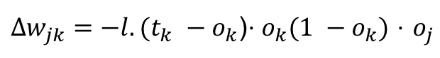

Generalmente, `l` es un valor pequeño, de modo que seamos más cautelosos sobre pasarnos del mínimo, pero tampoco podemos hacerlo muy pequeño, o el entrenamiento de nuestra red tomará demasiado tiempo. Hay bastante literatura de investigación sobre cómo establecer la [mejor velocidad de aprendizaje](https://www.jeremyjordan.me/nn-learning-rate/).

## Sesgo

Con nuestra red neuronal actual, la función de activación es una sigmoide que corta el eje `y` en 0.5, Cualquier cambio en los pesos solo cambia la pendiente de la sigmoide. Como resultado, hay una limitación en la forma en que la neurona se activa. Por ejemplo, hacer que la sigmoide devuelva un valor bajo de 0.1 cuando `x` es 2 va a ser imposible.

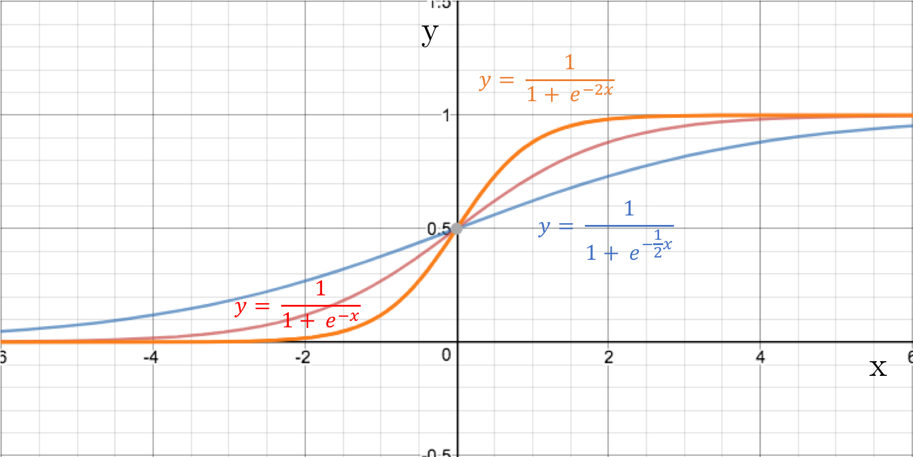

Sin embargo, si añadimos un [_sesgo_](http://makeyourownneuralnetwork.blogspot.sg/2016/06/bias-nodes-in-neural-networks.html) a `x`, todo cambia.

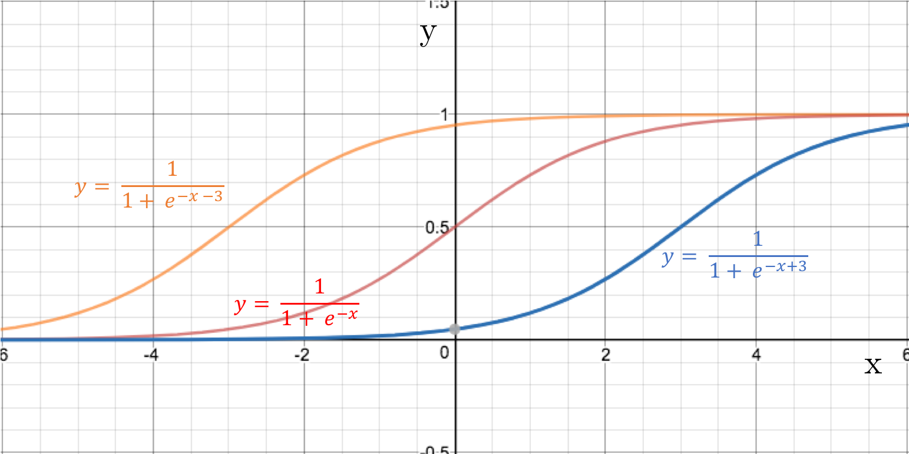

Esto lo hacemos añadiendo algo llamado una _neurona de sesgo_ a la red neuronal. Esta neurona de sesgo siempre da un 1.0 como salida y es añadida a las capas, pero no tiene ninguna entrada.

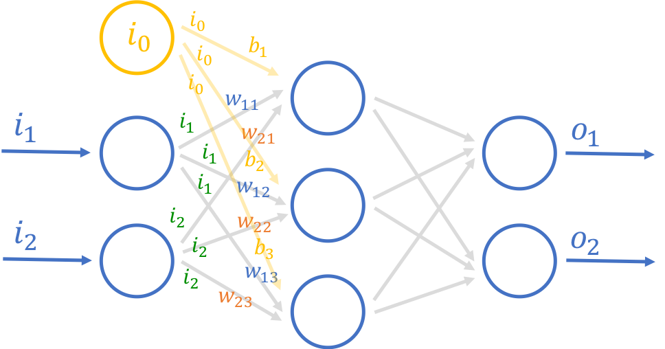

No todas las redes neuronales necesitan neuronas de sesgo. En la red que haremos para este proyecto no usaremos ninguna neurona de sesgo (y sigue funcionando bastante bien).

## El código

Finalmente, después de todos estos conceptos y operaciones, comenzamos con la implementación. Para este proyecto usaremos el lenguaje de programación [Go](https://golang.org/).

Por ahora, Go no tiene mucho soporte en el tema de librerías para machine learning, a diferencia de Python. Sin embargo, existe una librería muy útil llamada [Gonum](<[Gonum](https://www.gonum.org/)>) que provee lo que más necesitamos: Manipulación de matrices.

Adicionalmente, aunque Gonum tiene un paquete bastante completo, es recomendable crear algunos wrappers para evitar la verbosidad del paquete.

## Wrappers para matrices

Empezaremos con estos wrappers. El paquete principal de Gonum para la manipulación de matrices se llama `mat`. Lo que usaremos principalmente es la interfaz `mat.Matrix` y su implementación `mat.Dense`.

El paquete `mat` tiene una particularidad: Requiere la creación de una nueva matriz con las filas y columnas exactas antes de poder ejecutar las operaciones en las matrices. Hacer esto para múltiples operaciones sería bastante molesto, así que creamos un wrapper para cada función.

Por ejemplo, la función `Product` de Gonum nos permite realizar la operación de producto punto en dos matrices, y creamos una función auxiliar que averigua el tamaño de la matriz, la crea y realiza la operación antes de devolver la matriz resultante.

Esto nos ayuda a ahorrar un puñado de líneas dependiendo de la operación.

```go
func dot(m, n mat.Matrix) mat.Matrix {
	r, _ := m.Dims()
	_, c := n.Dims()
	o := mat.NewDense(r, c, nil)
	o.Product(m, n)
	return o
}
```

La función `apply` nos permite aplicar una función sobre una matriz.

```go
func apply(fn func(i, j int, v float64) float64, m mat.Matrix) mat.Matrix {
	r, c := m.Dims()
	o := mat.NewDense(r, c, nil)
	o.Apply(fn, m)
	return o
}
```

La función `scale` nos permite escalar una matriz, es decir, multiplicar una matriz por un escalar.

```go
func scale(s float64, m mat.Matrix) mat.Matrix {
	r, c := m.Dims()
	o := mat.NewDense(r, c, nil)
	o.Scale(s, m)
	return o
}
```

La función `multiply` multiplica dos matrices entre sí (esto es diferente al producto punto).

```go
func multiply(m, n mat.Matrix) mat.Matrix {
	r, c := m.Dims()
	o := mat.NewDense(r, c, nil)
	o.MulElem(m, n)
	return o
}
```

Las funciones `add` y `subtract` nos permiten sumar o restar una matriz de otra.

```go
func add(m, n mat.Matrix) mat.Matrix {
	r, c := m.Dims()
	o := mat.NewDense(r, c, nil)
	o.Add(m, n)
	return o
}

func subtract(m, n mat.Matrix) mat.Matrix {
	r, c := m.Dims()
	o := mat.NewDense(r, c, nil)
	o.Sub(m, n)
	return o
}
```

Finalmente, la función `addScalar` nos permite sumar un valor escalar a cada elemento en una matriz.

```go
func addScalar(i float64, m mat.Matrix) mat.Matrix {
	r, c := m.Dims()
	a := make([]float64, r*c)
	for x := 0; x < r*c; x++ {
		a[x] = i
	}
	n := mat.NewDense(r, c, a)
	return add(m, n)
}
```

## La red neuronal

Aquí vamos con la red. Crearemos una red neuronal de tres capas muy simple. Empezamos definiendo la red:

```go
type Network struct {
	Inputs        int
	Hiddens       int
	Outputs       int
	HiddenWeights *mat.Dense
	OutputWeights *mat.Dense
	LearningRate  float64
}
```

Los campos `Inputs`, `Hiddens` y `Outputs` definen el número de neuronas en cada una de las capas de entrada, oculta y salida. Los campos `HiddenWeights` y `OutputWeights` son matrices que representan los pesos de la capa de entrada a la capa oculta, y de la capa oculta a la capa de salida respectivamente. Finalmente, `LearningRate` es, bueno, la tasa de aprendizaje de la red.

Luego creamos un constructor para la red.

```go
// NewNetwork creates a neural network with random weights
func NewNetwork(input, hidden, output int, rate float64) (net *Network) {
	net = &Network{
		Inputs:       input,
		Hiddens:      hidden,
		Outputs:      output,
		LearningRate: rate,
	}
	net.HiddenWeights = mat.NewDense(net.Hiddens, net.Inputs, randomArray(net.Inputs*net.Hiddens, float64(net.Inputs)))
	net.OutputWeights = mat.NewDense(net.Outputs, net.Hiddens, randomArray(net.Hiddens*net.Outputs, float64(net.Hiddens)))
	return
}
```

El número de neuronas en cada capa es pasado desde el llamador para crear la red. Sin embargo, los pesos de la capa oculta y de salida son creados aleatoriamente.

Si recordamos de las secciones anteriores, los pesos que creamos son una matriz con el número de columnas representado por la capa _from_ y el número de filas representado por la capa _to_. Esto es porque el número de filas en el peso debe ser el mismo que el número de neuronas en la capa _to_ y el número de columnas debe ser el mismo número de neuronas que la capa _from_ (para poder multiplicar con las salidas de la capa _from_). Podemos tomar un momento para mirar los diagramas a continuación nuevamente, y tendrá más sentido.

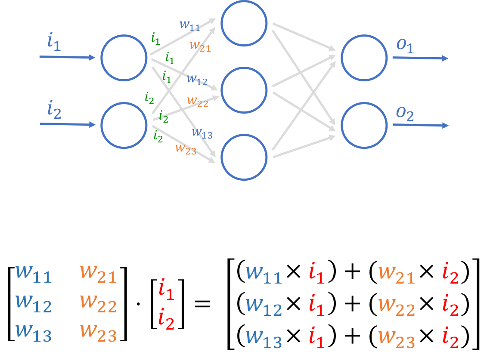

Inicializar los pesos con un conjunto aleatorio de números es un parámetro muy importante. Para esto usaremos una función `randomArray`.

```go
func randomArray(size int, v float64) (data []float64) {
	dist := distuv.Uniform{
		Min: -1 / math.Sqrt(v),
		Max: 1 / math.Sqrt(v),
	}

	data = make([]float64, size)
	for i := 0; i < size; i++ {
		data[i] = dist.Rand()
	}
	return
}
```

La función `randomArray` usa el paquete `distuv` en Gonum para crear un set de valores distribuidos uniformemente entre el rango de `-1/sqrt(v)` y `1/sqrt(v)` donde `v` es el tamaño de la capa _from_. Esta es una distribución comúnmente usada.

Ahora que tenemos nuestra red neuronal, las dos funciones principales que podemos pedirle que haga son entrenarse con un set de datos de entrenamiento, o predecir valores dados un set de datos de prueba.

## Entrenamiento y predicción

De todo lo documentado inicialmente en este artículo, sabemos que la predicción implica la propagación hacia adelante a través de la red, mientras que el entrenamiento significa propagación hacia adelante primero, luego propagación hacia atrás más tarde para cambiar los pesos usando algunos datos de entrenamiento.

Dado que tanto el entrenamiento como la predicción requieren propagación hacia adelante, empezaremos con esto. Definimos una función llamada `Predict` para predecir los valores usando la red neuronal entrenada.

```go
func (net *Network) Predict(inputData []float64) mat.Matrix {
	// feedforward
	inputs := mat.NewDense(len(inputData), 1, inputData)
	hiddenInputs := dot(net.HiddenWeights, inputs)
	hiddenOutputs := apply(sigmoid, hiddenInputs)
	finalInputs := dot(net.OutputWeights, hiddenOutputs)
	finalOutputs := apply(sigmoid, finalInputs)
	return finalOutputs
}
```

Empezamos con las entradas, creando una matriz llamada `inputs` para representar los valores de entrada. Luego encontramos las entradas a la capa oculta aplicando el producto punto entre los pesos ocultos y las entradas, creando una matriz llamada `hiddenInputs`. En otras palabras, dado una capa de entrada de 2 neuronas y una capa oculta de 3 neuronas, esto es lo que obtenemos:


Luego, aplicamos nuestra función de activación `sigmoid` a `hiddenInputs` para obtener `hiddenOutputs`.

```go
func sigmoid(r, c int, z float64) float64 {
	return 1.0 / (1 + math.Exp(-1*z))
}
```

Repetimos esas acciones para las entradas y salidas finales para producir `finalInputs` y `finalOutputs` respectivamente y la predicción es la salida final.

Así es como predecimos usando el algoritmo de propagación hacia adelante. Ahora veamos cómo hacemos la propagación hacia adelante y hacia atrás para entrenar la red.

```go
func (net *Network) Train(inputData []float64, targetData []float64) {
	// feedforward
	inputs := mat.NewDense(len(inputData), 1, inputData)
	hiddenInputs := dot(net.HiddenWeights, inputs)
	hiddenOutputs := apply(sigmoid, hiddenInputs)
	finalInputs := dot(net.OutputWeights, hiddenOutputs)
	finalOutputs := apply(sigmoid, finalInputs)

	// find errors
	targets := mat.NewDense(len(targetData), 1, targetData)
	outputErrors := subtract(targets, finalOutputs)
	hiddenErrors := dot(net.OutputWeights.T(), outputErrors)

	// backpropagate
	net.OutputWeights = add(net.OutputWeights,
		scale(net.LearningRate,
			dot(multiply(outputErrors, sigmoidPrime(finalOutputs)),
				hiddenOutputs.T()))).(*mat.Dense)

	net.HiddenWeights = add(net.HiddenWeights,
		scale(net.LearningRate,
			dot(multiply(hiddenErrors, sigmoidPrime(hiddenOutputs)),
				inputs.T()))).(*mat.Dense)
}
```

La parte de la propagación hacia delante es la misma que en la función `Predict`. No se llama a la función predict, sin embargo, porque aún se necesitan los valores intermedios.

La primera cosa que necesitamos hacer después de obtener las salidas finales es determinar los errores de salida. Esto es relativamente simple, solo restamos nuestros datos objetivo de las salidas finales para obtener `outputErrors`:


Los errores de la capa oculta son un poco más complejos. Para esto, usamos la propagación hacia atrás al aplicar el producto punto en la matriz transpuesta de los pesos de salida y los errores de salida. Esto nos dará `hiddenErrors`.

Ahora que tenemos los errores, sencillamente usamos la fórmula que derivamos anteriormente (incluyendo la tasa de aprendizaje) para los cambios en los pesos que necesitamos hacer:


Recordemos que estamos restando este número de los pesos. Dado que este es un número negativo, resultamos añadiéndolo a los pesos.

Para simplificar el cálculo usamos la función `sigmoidPrime`, que no es más que la derivada de la función sigmoide:

```go
func sigmoidPrime(m mat.Matrix) mat.Matrix {
	rows, _ := m.Dims()
	o := make([]float64, rows)
	for i := range o {
		o[i] = 1
	}
	ones := mat.NewDense(rows, 1, o)
	return multiply(m, subtract(ones, m)) // m * (1 - m)
}
```

También se puede ver que calculamos el producto punto de la respuesta de la salida previa - esto es porque estamos multiplicando a través de las distintas capas de la red.

Finalmente, hacemos esto dos veces para obtener los nuevos pesos ocultos y de salida de nuestra red neuronal.

## Persistencia de los resultados de entrenamiento

Antes de usar nuestra red neuronal, debemos almacenar los resultados del entrenamiento, para poder cargarlo cuando vayamos a realizar predicciones. Ciertamente no queremos entrenar desde cero cada vez que queramos hacer la predicción - entrenar la red puede tomar bastante tiempo.

```go
func (net *Network) Save() {
	h, err := os.Create("data/hweights.model")
	defer h.Close()
	if err == nil {
		net.HiddenWeights.MarshalBinaryTo(h)
	}
	o, err := os.Create("data/oweights.model")
	defer o.Close()
	if err == nil {
		net.OutputWeights.MarshalBinaryTo(o)
	}
}

// load a neural network from file
func (net *Network) Load() {
	h, err := os.Open("data/hweights.model")
	defer h.Close()
	if err == nil {
		net.HiddenWeights.Reset()
		net.HiddenWeights.UnmarshalBinaryFrom(h)
	}
	o, err := os.Open("data/oweights.model")
	defer o.Close()
	if err == nil {
		net.OutputWeights.Reset()
		net.OutputWeights.UnmarshalBinaryFrom(o)
	}
	return
}
```

Las funciones `Save` y `Load` son básicamente espejo la una de la otra, y usan una función muy conveniente del paquete `mat` de Gonum para convertir las matrices de pesos en forma binaria y deserializar la misma forma de nuevo a matrices. Esto es bastante mundano - lo único que vale la pena mencionar es que cuando deserializamos los datos binarios de nuevo a las matrices de pesos, necesitamos primero restablecer las matrices de nuevo a su valor cero para que puedan ser reutilizadas.

# Usando la red neuronal

Finalmente podemos ejecutar el código.

## El dataset MNIST

Comencemos con el uso del dataset MNIST para el reconocimiento de dígitos escritos a mano. El dataset MNIST es un set de 60000 imágenes escaneadas de dígitos escritos a mano utilizado para entrenamiento, y 10000 imágenes similares utilizadas para prueba. Es un subset de un set más grande del NIST (Instituto Nacional de Estándares y Tecnología) que ha sido normalizado en cuanto a tamaño y posición de las imágenes. Las imágenes son en blanco y negro y son de 28px x 28px. El dataset original está guardado en un formato que es más difícil de manipular, entonces quienes lo utilizan han puesto el dataset en formatos más simples, como [CSV](https://pjreddie.com/projects/mnist-in-csv/), como el que utilizaremos para este proyecto.

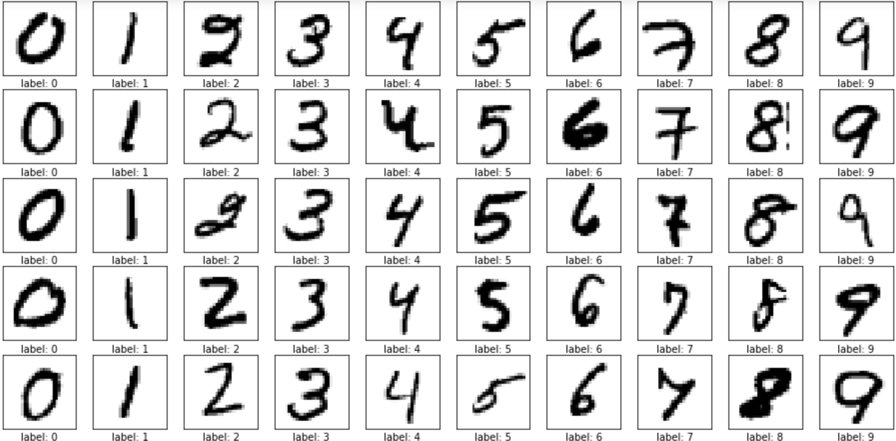

En este formato, cada línea representa una imagen, y cada columna excepto la primera representa un pixel. La primera columna es la etiqueta, la cual es el dígito real qye la imagen representa. En otras palabras, esta es la salida objetivo. Ya que hay 28x28 pixeles, esto quiere decir que hay 785 columnas en cada fila.

Empecemos con el entrenamiento. Crearemos una función receptora en el struct Network llamada `MnistTrain`, que inicia el entrenamiento con el dataset:

```go
func (net *Network) MnistTrain() {
	rand.NewSource(time.Now().UTC().UnixNano())
	t1 := time.Now()

	for epochs := 0; epochs < 5; epochs++ {
		testFile, _ := os.Open("mnist_dataset/mnist_train.csv")
		r := csv.NewReader(bufio.NewReader(testFile))
		for {
			record, err := r.Read()
			if err == io.EOF {
				break
			}

			inputs := make([]float64, net.Inputs)
			for i := range inputs {
				x, _ := strconv.ParseFloat(record[i], 64)
				inputs[i] = (x / 255.0 * 0.999) + 0.001
			}

			targets := make([]float64, 10)
			for i := range targets {
				targets[i] = 0.001
			}
			x, _ := strconv.Atoi(record[0])
			targets[x] = 0.999

			net.Train(inputs, targets)
		}
		testFile.Close()
	}
	elapsed := time.Since(t1)
	fmt.Printf("\nTime taken to train: %s\n", elapsed)
}
```

Abrimos el archivo CSV y leemos cada fila, luego procesamos cada fila. Para cada fila en el archivo creamos un arreglo que representa las entradas y un arreglo que representa los objetivos.

Para el arreglo `inputs` tomamos cada pixel de la fila, y lo convertimos a un valor entre 0.0 y 1.0 con 0.0 significando un pixel sin valor y 1.0 significando un pixel completo.

Para el arreglo `targets`, cada elemento del arreglo representa la probabilidad del índice de ser el dígito objetivo. Por ejemplo, si el dígito objetivo es 3, entonces el cuarto elemento `targets[3]` tendría una probabilidad de 0.9 mientras que el resto tendría una probabilidad de 0.1.

Una vez tenemos las entradas y los objetivos, llamamos la función `Train` de la red y le pasamos las entradas y los objetivos.

Es notable que corremos esto en _epochs_. Básicamente lo que hacemos es correr esto múltiples veces porque mientras más veces corramos el entrenamiento, mejor entrenada estará la red neuronal. Sin embargo, si la entrenamos demasiado, la red neuronal se _sobreentrenará_, lo que significa que se adaptará demasiado bien con los datos de entrenamiento y al final tendrá un mal desempeño con datos que no ha visto antes.

Predecir las imágenes es básicamente lo mismo, excepto que llamamos la función `Predict` con solo las entradas.

```go
func (net *Network) MnistPredict() {
	t1 := time.Now()
	checkFile, _ := os.Open("mnist_dataset/mnist_test.csv")
	defer checkFile.Close()

	score := 0
	r := csv.NewReader(bufio.NewReader(checkFile))
	for {
		record, err := r.Read()
		if err == io.EOF {
			break
		}
		inputs := make([]float64, net.Inputs)
		for i := range inputs {
			if i == 0 {
				inputs[i] = 1.0
			}
			x, _ := strconv.ParseFloat(record[i], 64)
			inputs[i] = (x / 255.0 * 0.999) + 0.001
		}
		outputs := net.Predict(inputs)
		best := 0
		highest := 0.0
		for i := 0; i < net.Outputs; i++ {
			if outputs.At(i, 0) > highest {
				best = i
				highest = outputs.At(i, 0)
			}
		}
		target, _ := strconv.Atoi(record[0])
		if best == target {
			score++
		}
	}

	elapsed := time.Since(t1)
	fmt.Printf("Time taken to check: %s\n", elapsed)
	fmt.Println("score:", score)
}
```

Los resultados que obtenemos son un arreglo de probabilidades. Determinamos el elemento con la probabilidad más alta y el dígito debería ser el índice de ese elemento. Si es así, lo contamos como un acierto. El conteo final de los aciertos es nuestro puntaje final.

Debido a que tenemos 10000 imágenes de prueba, si logramos detectarlas todas con precisión entonces tendremos un 100% de precisión. Veamos la función `main`:

```go
func main() {
	// 784 inputs - 28 x 28 pixels, each pixel is an input
	// 100 hidden nodes - an arbitrary number
	// 10 outputs - digits 0 to 9
	// 0.1 is the learning rate
	net := network.NewNetwork(784, 200, 10, 0.1)

	mnist := flag.String("mnist", "", "Either train or predict to evaluate neural network")
	file := flag.String("file", "", "File name of 28 x 28 PNG file to evaluate")
	invert := flag.Bool("invert", false, "Invert the image before prediction")
	flag.Parse()

	// train or mass predict to determine the effectiveness of the trained network
	switch *mnist {
	case "train":
		net.MnistTrain()
		net.Save()
	case "predict":
		net.Load()
		net.MnistPredict()
	default:
		// don't do anything
	}

	// predict individual digit images
	if *file != "" {
		// print the image out nicely on the terminal
		utils.PrintImage(utils.GetImage(*file), *invert, *file)
		// load the neural network from file
		net.Load()
		// predict which number it is
		fmt.Println("prediction:", net.PredictFromImage(*file))
	}
}
```

Esta función es bastante simple. Primero creamos la red neuronal con 784 neuronas en la capa de entrada (cada pixel es una entrada), 200 neuronas en la capa oculta y 10 neuronas en la capa de salida, una para cada dígito.

Luego entrenamos la red con el dataset de entrenamiento MNIST, y predecimos las imágenes con el dataset de prueba. Esto es lo que tenemos cuando lo probamos:

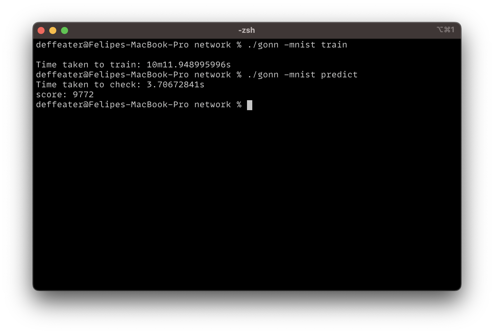

Nos tomó 8 minutos entrenar la red con 60000 imágenes y 5 epochs, y 4.4 segundos para probarla con 10000 imágenes. El resultado es que 9772 imágenes fueron predichas correctamente, lo que es un 97.72% de precisión. No está nada mal para una red neuronal tan simple.

## Predicción de archivos individuales

Ahora que hemos probado nuestra red, veamos cómo usarla en imágenes individuales. Primero obtenemos los datos del archivo PNG. Para hacer esto, creamos una función `dataFromImage`.

```go
func dataFromImage(filePath string) (pixels []float64) {
	// read the file
	imgFile, err := os.Open(filePath)
	defer imgFile.Close()
	if err != nil {
		fmt.Println("Cannot read file:", err)
	}
	img, err := png.Decode(imgFile)
	if err != nil {
		fmt.Println("Cannot decode file:", err)
	}

	// create a grayscale image
	bounds := img.Bounds()
	gray := image.NewGray(bounds)

	for x := 0; x < bounds.Max.X; x++ {
		for y := 0; y < bounds.Max.Y; y++ {
			var rgba = img.At(x, y)
			gray.Set(x, y, rgba)
		}
	}
	// make a pixel array
	pixels = make([]float64, len(gray.Pix))
	// populate the pixel array subtract Pix from 255 because that's how
	// the MNIST database was trained (in reverse)
	for i := 0; i < len(gray.Pix); i++ {
		pixels[i] = (float64(255-gray.Pix[i]) / 255.0 * 0.999) + 0.001
	}
	return
}
```

Cada pixel en la imagen representa un valor pero no podemos usar el RGBA normal. En su lugar, necesitamos un `image.Gray`. De este struct `image.Gray` obtenemos el valor `Pix` y los traducimos a un valor de tipo `float64`. La imagen de MNIST es blanca sobre negro, entonces debemos restar cada valor de pixel de 255.

Una vez tenemos el arreglo de pixeles, es bastante simple: Usamos la función receptora `PredictFromImage` que predice el dígito desde un archivo de imagen. El resultado es un arreglo de probabilidades donde el índice es el dígito. Lo que debemos hacer es encontrar el index y retornarlo.

```go
func (net *Network) PredictFromImage(path string) int {
	input := dataFromImage(path)
	output := net.Predict(input)
	matrixPrint(output)
	best := 0
	highest := 0.0
	for i := 0; i < net.Outputs; i++ {
		if output.At(i, 0) > highest {
			best = i
			highest = output.At(i, 0)
		}
	}
	return best
}
```

Finalmente, en la función `main` se imprime la imagen y se predice el dígito de la imagen.

```go
func main() {
	// 784 inputs - 28 x 28 pixels, each pixel is an input
	// 100 hidden nodes - an arbitrary number
	// 10 outputs - digits 0 to 9
	// 0.1 is the learning rate
	net := network.NewNetwork(784, 200, 10, 0.1)

	mnist := flag.String("mnist", "", "Either train or predict to evaluate neural network")
	file := flag.String("file", "", "File name of 28 x 28 PNG file to evaluate")
	invert := flag.Bool("invert", false, "Invert the image before prediction")
	flag.Parse()

	// train or mass predict to determine the effectiveness of the trained network
	switch *mnist {
	case "train":
		net.MnistTrain()
		net.Save()
	case "predict":
		net.Load()
		net.MnistPredict()
	default:
		// don't do anything
	}

	// predict individual digit images
	if *file != "" {
		// print the image out nicely on the terminal
		utils.PrintImage(utils.GetImage(*file), *invert, *file)
		// load the neural network from file
		net.Load()
		// predict which number it is
		fmt.Println("prediction:", net.PredictFromImage(*file))
	}
}
```

Asumiendo que la red ha sido entrenada previamente, este es el resultado.

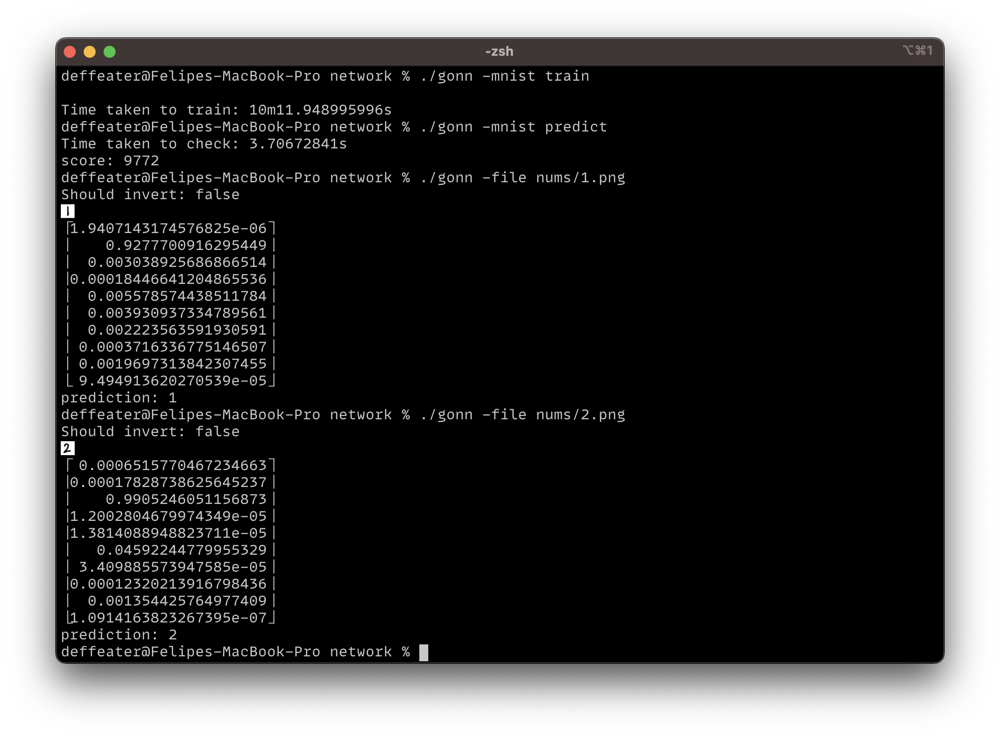

Y eso es todo. Hemos escrito una red neuronal simple de tres capas desde ceros usando Go.

# Referencias

Aquí hay algunas de las referencias usadas para la construcción de este proyecto.

- [Make Your Own Neural Network 1.0, Tariq Rashid, eBook - Amazon.com](https://www.amazon.com/Make-Your-Own-Neural-Network-ebook/dp/B01EER4Z4G) de Tariq Rashid es un gran libro para aprender los básicos de las redes neuronales con explicaciones simples.
- [Neural Networks and Deep Learning](http://neuralnetworksanddeeplearning.com/) de Michael Nielsen es otro gran recurso para aprender los detalles de la construcción de redes neuronales.
- Daniel Whitenack escribió un libro: _Machine Learning With Go_, y su post sobre la [construcción de una red neuronal en Go](http://www.datadan.io/building-a-neural-net-from-scratch-in-go/) es bastante educativo.
- El blog de ingeniería de datos de Ujjwal Karn tiene un gran [post introductorio a las redes neuronales](https://ujjwalkarn.me/2016/08/09/quick-intro-neural-networks/).
